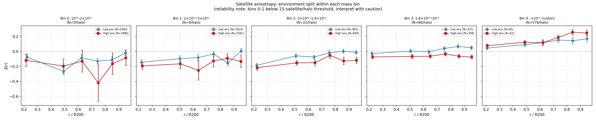
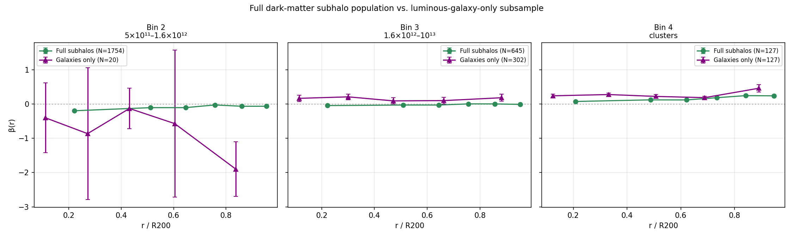
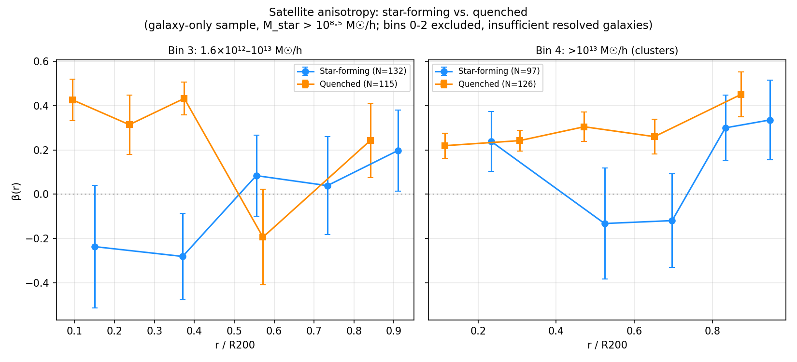
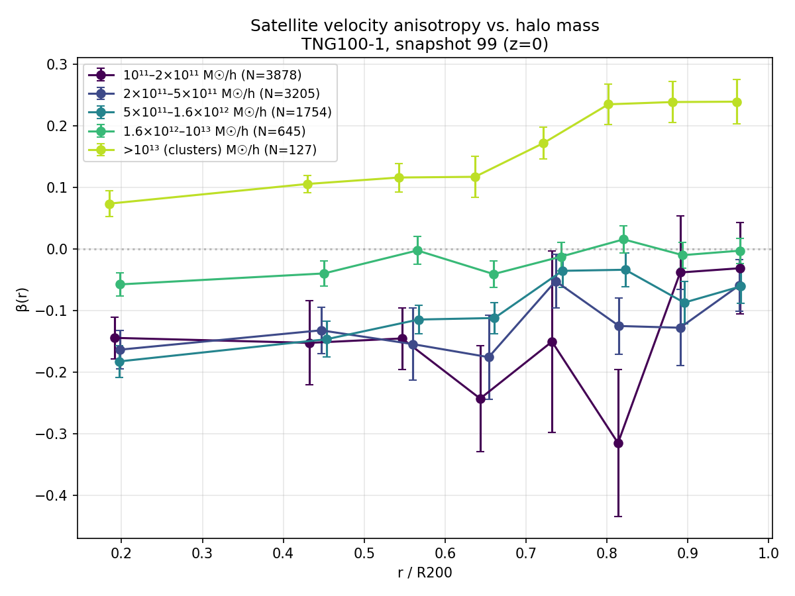
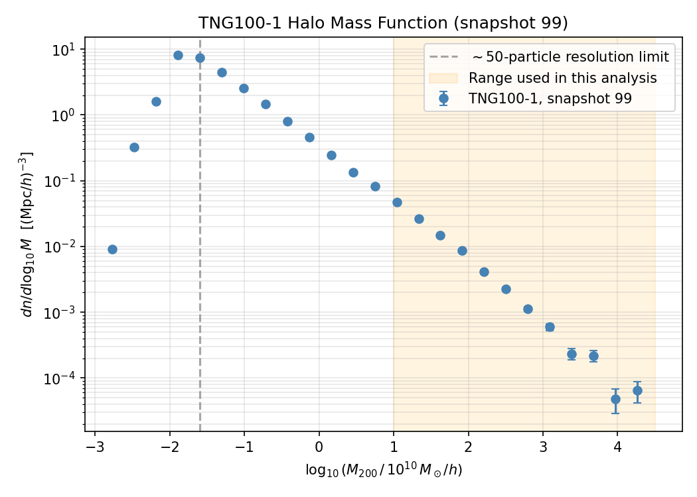
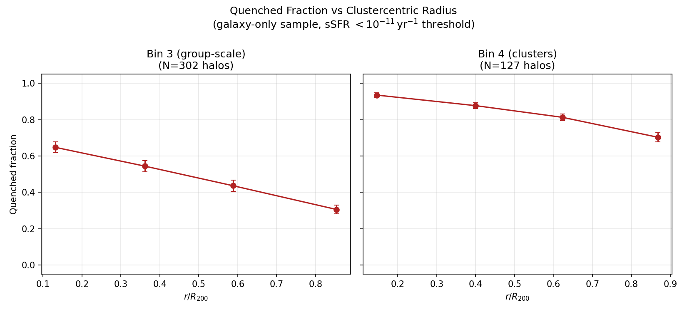

# TNG Anisotropy Atlas

Velocity anisotropy of satellite galaxy populations in IllustrisTNG:
a reproducible measurement pipeline and population atlas across halo
mass, environment, and galaxy-population bins.

**Status:** Complete.
See `notebooks/01_toy_validation.ipynb` for pipeline validation on
synthetic halos with known anisotropy, and `notebooks/02_real_data.ipynb`
for the IllustrisTNG-based analysis.

## Goal

Measure satellite velocity anisotropy β(r) = 1 − σ_t²/(2σ_r²) in
IllustrisTNG-100 at z = 0, validated against literature benchmarks
(Wojtak, Hansen & Hjorth 2013; standard N-body halo profiles), as a
baseline for testing alternative dynamical frameworks in standard
cosmology.

## Preliminary

Before applying the estimator to IllustrisTNG data, I validated the complete 
velocity-anisotropy pipeline on synthetic halo populations with prescribed anisotropy. 
The recovered profiles agreed with the input values within ensemble uncertainties.

## What this project contains

- **Toy-model validation**: synthetic halos with known input β,
  recovering the correct value via ensemble tests, confirming the
  measurement pipeline is unbiased before touching real data.
- **Real IllustrisTNG-100 data** (snapshot 99): host halos selected
  in 5 mass bins, satellite kinematics measured, stacked β(r) profiles
  with bootstrap errors (resampling host halos, not individual
  satellites, to respect intra-halo correlation).
- **Environment analysis**: neighbor-count-based environment measure,
  Spearman and partial-Spearman correlations with β, and a
  mass-controlled environment split.
- **Resolution checks**: a halo mass function confirming the analysis
  sample sits well above the ~50-particle resolution limit, and a
  documented stellar-mass resolution floor for resolved galaxies.
- **Galaxy-population splits**: full-subhalo vs. resolved-galaxy-only
  comparison, and star-forming/quenched splits, including a radial
  quenched-fraction profile in cluster-mass halos.

## Structure
src/
kinematics.py — radial_tangential_split(), beta_profile()
halo_sample.py — periodic_distance(), select_host_halos(), build_satellite_catalog()
tng_io.py — TNG data download and catalog loading
statisitics.py — stacked/per-halo statistics, correlations, environment,
SF/quenched classification, radial quenched-fraction profile
plotting.py — reusable plotting functions
notebooks/
01_toy_validation.ipynb — pipeline validation on synthetic data
02_real_data.ipynb — full IllustrisTNG-100 analysis
figures/ — final figures (see below)
report/ — LaTeX write-up

## Figures

**Beta Environment Split**

**Beta Galaxy Vs Full**

**Beta Sf Quenched**

**Beta Vs Mass**

**Halo Mass Function**

**Quenched Fraction Radial**

## Data

IllustrisTNG public data release (Nelson et al. 2019), TNG100-1,
snapshot 99, accessed via `illustris_python` and the TNG public API.

## License

MIT
